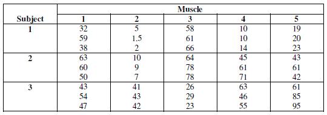
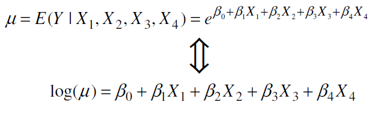

# Answers

<br>

## Question 1

  For full code see appendix [A1](#a1).
  
> An educator believes that a new reading curriculum will help elementary school students improve some aspects of their reading ability. She arranges for a third-grade class of 21 students to take part in the new curriculum for an eight-week period. A control classroom of 23 third-graders follows the standard curriculum. At the end of the eight weeks, all students are given a Degree of Reading Power (DRP) test, which measures aspects of reading that the treatment is designed to improve “DRPscores.txt”.
>
> Test the hypothesis that the treatment group performed better than the control group on the test. State your conclusions.

```{r, include = F}

q1.data <- data.frame(read.table("data/DRPscores.txt", header = F, sep = ""))
colnames(q1.data) <- c("Group", "Score")
q1.data.treat <- q1.data[q1.data$Group == "Treat",]
q1.data.contr <- q1.data[q1.data$Group == "Control",]

```

  The size of our control group is 23 and the size of our treatment group is 21. Since these sample sizes are both less than 30 we should use a t-test of sample means. Before doing so however, we need to check that our assumption that the data are normally distributed is valid. To this end we will use the Shapiro-Wilk test for normality. The null hypothesis of the Shapiro-Wilk test is that the data are normally distributed and the alternative hypothesis is that they are not. Thus a small p-value (less than 0.05) indicates that the data are *not* normally distributed whereas a large p-value indicates that there is no significant evidence that the data are not normally distributed. Table 1 gives the p-values for the Shapiro-Wilk test for both groups. The large p-values indicate that we fail to reject the null hypothesis and conclude that the data are normally distributed.
  
```{r, include=F}

Nt.c <- shapiro.test(q1.data.contr$Score)
Nt.t <- shapiro.test(q1.data.treat$Score)

```

***

```{r, echo =F, results = "asis"}
library(pander)
panderOptions("table.caption.prefix", "")

x <- data.frame(Group = c("Treatment", "Control"), "P-Value" = c(Nt.t$p.value, Nt.c$p.value) )

pandoc.table(x,
             caption = "**Table 1:** P-values for Shapiro-Wilk tests for normality. The large p-values for both groups indicate that there is no evidence that either group is *not* normally distributed.",
             split.table = Inf)

```

***


  Next we need to test if the variances of the underlying populations for the two samples is significantly different. For this we will use an F-test for the equality of population variances. The null hypothesis for the F-test is that the two population variances are equal, the alternative is that they are not equal (for the two-tailed scenario, which is what we are interested in). The test-statistic for the F-test is the ratio of the two sample variances (sample 1 variance to sample 2 variance), the further away from 1 the test-statistic is the more likely it is that the null hypothesis is false. Under the null hypothesis (that the two population variances are equal), the test-statistic has an F-distribution with numerator degrees of freedom equal to the size of first sample minus 1, and denominator degrees of freedom equal to the size of the second sample minus 1. See below.

  $$ \text{F} = \frac{S_1^2}{S_2^2} \sim F_{(n_1 - 1)(n_2 - 2)} $$

  We can use the "var.test()" function in R to perform the above described F-test. For small p-values (< 0.05) we should reject the null hypothesis that the population variances are equal in favor of the alternative hypothesis that they are different. For large p-value we should fail to reject the null hypothesis and conclude that the population variances are equal. Table 2 reports the calculated F-statistic and corresponding p-value. The p-value is greater than 0.05 so we fail to reject the null hypothesis and conclude that the two populations have the same variance.
  
```{r, include=F}

VT <- var.test(q1.data.treat$Score, q1.data.contr$Score)

```
  
***

```{r, echo=F, results="asis"}

x <- data.frame("F" = VT$statistic, "P-Value" = VT$p.value)

pandoc.table(x,
             caption = "**Table 2:** Test statistic corresponding p-value for test of equality of variances. Since the p-value is greater than 0.05 (even if just so) we will conclude that the population variances can be assumed similar.",
             split.table = Inf)

```

***

  Now that we have verified our assumptions that the two populations have are normally distributed with equal variances, we will perform a one-tailed two-sample t-test for the difference of means. Our null hypothesis is that the mean score of students taught with the new curriculum is no greater than students taught under the old curriculum; our alternative hypothesis is that the mean score is higher.
  
  $$ \text{H}_o: \mu_t - \mu_c \leq 0 \space \space \space \space \space v.s. \space \space \space \space \text{H}_a: \mu_t - \mu_c > 0$$
  The test-statistic for this test is the difference between the sample means divided by the pooled sample variance. Under the null hypothesis this test-statistic has a t-distribution with degrees of freedom equal to the sum of the sample sizes minus 2.
  
  $$ \text{T} = \frac{\bar{x_t} - \bar{x_c}}{S_p  \sqrt{ \frac{1}{n_1} + \frac{1}{n_2} }} \sim{t_{n_1 + n_2 - 2}} \\  \\ \text{where:} \space \space \space S_p = \sqrt{ \frac{ (n_1 -1)S_1^2 + (n_2 - 1)S_2^2 }{n_1 + n_2 - 2} }$$

  The large a positive test-statistic we observe the more likely it is that the mean score of students taught under the new curriculum is greater than that of those taught under the old curriculum. We will use and alpha level of 0.05, so we will reject our null hypothesis if the p-value (probability of observing a value larger than the one we observe) of our observed test-stastic is less than 0.05. We can use the R function "t.test()" to perform this test. Table 3 reports observed test-statistic and corresponding p-value.
  
```{r, include=F}

tT <- t.test(x = q1.data.treat$Score, y = q1.data.contr$Score, alternative = "greater", var.equal = T)

```

***

```{r, echo=F, results="asis"}

x <- data.frame("T" = tT$statistic, "P-Value" = tT$p.value)
rownames(x) <- NULL

pandoc.table(x,
             caption = "**Table 3:** Test-statistc and corresponding p-value for one-tailed two-sample t-test.",
             split.table = Inf)

```

***

  Since our p-value is less than 0.05 we reject the null hypothesis that the mean scores did not differ in favor of the alternative hypothesis that they did. Thus, we conclude that the students taught under the new curriculum performed better on the test than students taught under the old curriculum.

<br>
<br>

## Question 2

  For full code see appendix [A2](#a2)

> A company is rated as acceptable in quality control if more than 90% of units produced at
its facilities are found to be defect-free, and it is rated as excellent in quality control if
more than 95% are defect-free. Suppose that a random sample of 500 units is selected and
tested for defects, and that 18 units are found to have defects.
>
>a. Does this data show at the 5% level of significance that the company is acceptable?
>b. Does it show that the company is excellent? Construct a 95% confidence interval for
proportion of defect-free units.
>c. What sample size should a reliability engineer use to estimate this proportion to within
2% with 95% confidence if it is assumed that the proportion of units that are defect-free
is at least 90%?

  Estimated proportion defect-free:
  
  $$ \widehat{p} = \frac{500 - 18}{500} = .964 \rightarrow 96.4\% $$
  Approximate standard error of the proportion defect free:
  
  $$ \widehat{\text{SE}}[\widehat{p}] = \sqrt{\frac{\widehat{p}(1 - \widehat{p})}{n}} = \sqrt{\frac{.964*.036}{500}} \approx 0.00833 $$

<br>

### Part A

  One-tailed hypothesis test with alpha = 0.05.

* Null hypothesis The proportion of products defect-free is less than or equal to 0.90
    + $\text{p}_o \leq 0.90$
* Alternative hypothesis The proportion of products defect-free is greater than 0.90
    + $\text{p}_a > 0.90$

In order to test the above null hypothesis we will used a one-tailed Z-test with an alpha level of 0.05. The formula for the test statistic is given below:

  $$ \text{Z} = \frac{\widehat{p} - \text{p}_o}{\sqrt{\frac{\widehat{p}(1 - \widehat{p})}{n}}} \sim AN(0,1) $$

So in our case the test statistic is:

   $$ \text{Z} = \frac{0.964 - 0.90}{0.00833} \approx 7.71 $$
Using the "pnorm()" function in R we find that the probability of observing a test statisitic this large or larger under the null hypothesis is less than 0.05. Table Q2A reports the test statistic and p-value. Since the p-value is less than 0.05 (much less in fact) we reject the null hypothesis and conclude at a 5% level of significance that the company is acceptable (proportion of products defect free is greater than 0.90).

***

```{r, echo=F, results="asis"}

x <- data.frame("Z" = 7.71, "P-Value" = pnorm(7.71, lower.tail = F))
colnames(x) <- c("Test Statistic", "P-value")

pandoc.table(x,
             caption = "**Table Q2A:** Observed test-statistic and corresponding p-value for one-tailed Z-test.",
             split.table = Inf)

```

***

<br>
<br>

### Part B

  One-tailed hypothesis test with alpha = 0.05.

* Null hypothesis The proportion of products defect-free is less than or equal to 0.95
    + $\text{p_o} \leq 0.95$
* Alternative hypothesis The proportion of products defect-free is greater than 0.95
    + $\text{p_a} > 0.95$
    
    We will conduct this hypothesis test in just the same way as in part A, except now we will use $\text{p}_o = 0.95$. Thus our test statistic under these conditions is:
    
    $$ \text{Z} = \frac{0.964 - 0.95}{0.00833} \approx 1.687 $$
    
    Using the "pnorm()" function in R we find that the probability of observing a test statisitic this large or larger under the null hypothesis is slightly less than 0.05. Table Q2B reports the test statistic and p-value. Since the p-value is less than 0.05 (though close) we reject the null hypothesis and conclude at a 5% level of significance that the company is excellent (proportion of defect-free products is greater than 0.95).

***

```{r, echo=F, results="asis"}

x <- data.frame("Z" = 1.687, "P-Value" = pnorm(1.687, lower.tail = F))
colnames(x) <- c("Test Statistic", "P-value")

pandoc.table(x,
             caption = "**Table Q2B:** Observed test-statistic and corresponding p-value for one-tailed Z-test.",
             split.table = Inf)

```

***

<br>
<br>

### Part C

  We want to determine how large the sample size *n* must be in order to have an error margin *E* of 2% ($\pm 2\%$). Below we show the formula for the sample size *n* for a desired margin of error:
  
  $$ n = \text{p}(1- \text{p})*(\frac{Z_{\alpha/2}}{E})^2 $$
  Since we want a 95% confidence interval *Z* = 1.96. We already know we want *E* to be 0.02 and the question says that p is assumed to be 0.90 thus:

$$ n = 0.9*0.1*(\frac{1.96}{0.02})^2 \approx 864.26 \rightarrow 864 $$
  So, assuming the proportion of units defect free is at least 90%, if we want to estimate the proportion of products defect free within $\pm 2\%$ with 95% confidence we should have a sample size of 864.

<br>
<br>

## Question 3

  For full code see appendix [A3](#a3)

> A large corporation requires that its employees attend a 1-day sexual harassment seminar.
The Director of Human Resources of this corporation would like to determine whether or
not the information presented in this seminar is retained over a long period of time. To
this end, a random sample of 40 employees is selected from recently hired employees
who are scheduled to take this seminar. Each of the employees in this sample completes a
test of knowledge concerning sexual harassment and related legal issues immediately
after the seminar, and then takes a similar test 6 months later. The scores are contained in
the file “harass.txt”.
>
>Does that data indicate at the 5% level of significance that the mean score has changed
after 6 months? Construct a 95% confidence interval for the difference between the
mean scores.
  
```{r, include=F}
# Load data set

q3.data <- data.frame(read.table("data/harass.txt", header = T, sep = ""))

```

  We are dealing with paired data here (difference between test score of the same subject at different time points) so we will use a paired t-test. We can do this using the "t.test()" function in R and setting the argument "paired" to **TRUE**, this tell the function that the data is paired. Since the question just asks whether the mean score has changed, and not in what direction it has changed, this will be a two-tailed test. The null hypothesis is that the mean difference between the scores is 0, the alternative hypothesis is that it is not equal to zero. For this test we will use an alpha level of 0.05. However, before doing the test we will check to see if the data are normally distributed using the Shapiro-Wilk test. The null hypothesis is that the data are normally distributed and the alternative hypothesis is that they are not (we will use an alpha level of 0.05). R has a built in function called "shapiro.test()". Table Q3A shows the results of the Shapiro-Wilk test for the scores from test 1, test 2, and the difference between the scores. Since all the p-values are greater than 0.05 we will accept the assumption that our data are normally distributed.

***

```{r, echo=F, results="asis"}

x <- data.frame("P.value" = c(shapiro.test(q3.data$Test1)$p.value,
                              shapiro.test(q3.data$Test2)$p.value,
                              shapiro.test(q3.data$Test1 - q3.data$Test2)$p.value))
colnames(x) <- "P-Value"
rownames(x) <- c("Scores from Test 1", "Scores from Test 2", "Difference between Scores")

pandoc.table(x,
             caption = "**Table Q3A:** P-values from the Shapiro-Wilk normality test for our data. Since all the p-values are greater than 0.05 we will accept the null hypothesis that our data are normally distributed.",
             split.table = Inf)

```

***

  Table Q3B gives the observed test statistic and p-value for the two sample t-test for the difference between scores. Since the p-value is greater than 0.05 we will accept the null hypothesis and conclude that there is not sufficient evidence to show that the mean score has changed over 6 months.

***

```{r, echo=F, results="asis"}

results <- t.test(q3.data$Test2, q3.data$Test1, paired = T)

x <- data.frame("S" = results$statistic, "P" = results$p.value)
rownames(x) <- NULL
colnames(x) <- c("Test Statistic", "P-Value")

pandoc.table(x,
             caption = "**Table Q3B:** The observed test statistic and p-value for the paired t-test. Since the p-value is greater than 0.05 we cannot conclude that the mean scores changed.",
             split.table = Inf)
```

***

  We can also use the output from the t.test function to give us a 95% confidence for the difference between the mean scores. Table Q3C reports this confidence interval. As we can see the confidence interval includes zero, once again indicating that there is insufficient evidence of a change in the mean scores.

***

```{r, echo=F, results="asis"}

x <- data.frame("LB" = results$conf.int[1], "UB" = results$conf.int[2])
colnames(x) <- c("Lower Bound", "Upper Bound")

pandoc.table(x,
             caption = "**Table Q3C:** 95% confidence interval for the difference between the mean scores. Notice that the confidence interval includes 0, indicating that there is no significant evidence of a difference between the mean scores.",
             split.table = Inf)
```  

***

<br>
<br>

## Question 4

 For full code see appendix [A4](#a4)

> The goal for the mean time to resolve software problems by the software support group
of a large corporation is 24 hours. Suppose that 60 software problem items are randomly
selected from all such items over the past quarter, and the mean time to resolve the
problems was 22.4 hours with a standard deviation of 9.6 hours.
>
> a. Does this data show at the 10% level of significance that the mean resolution time is less
than 24 hours?
> b. Construct a 90% confidence interval for the mean resolution time.
> c. What sample size would be required to estimate the mean time to within 0.5 hours with
90% confidence if it is assumed that the standard deviation will be no more than 10
hours?

### Part A

One-tailed hypothesis test with alpha = 0.1.

* Null hypothesis: The mean resolution time is greater than or equal to 24 hours
    + $\mu_o \geq 24 \rightarrow \widehat{\mu} - \mu_o \geq 0$
* Alternative hypothesis: The mean resolution time is less than 24 hours
    + $\mu_a < 24 \rightarrow \widehat{\mu} - \mu_o < 0$

In order to test the above null hypothesis we will used a one-tailed Z-test with an alpha level of 0.05. The test statistic is given below:

  $$ \text{Z} = \frac{\widehat{\mu} - \mu_o}{\frac{\sigma}{\sqrt{n}}} \sim AN(0,1) $$

So in our case the test statistic is:

  $$ \text{Z} = \frac{22.4 - 24}{\frac{9.6}{\sqrt{60}}} \approx -1.291 $$
  Using the "pnorm()" function in R we find that the probability of observing a test statisitic this small or smaller under the null hypothesis is slightly less than 0.1. Table Q4A reports the test statistic and p-value. Since the p-value is less than 0.1 (though close) we reject the null hypothesis and conclude at a 10% level of significance that the mean resolution time is less than 24 hours. However, we are not very emphatic about our conclusion since the p-value is quite close to 0.1.

***

```{r, echo=F, results="asis"}

x <- data.frame("Z" = -1.291, "P-Value" = pnorm(-1.291, lower.tail = T))
colnames(x) <- c("Test Statistic", "P-value")

pandoc.table(x,
             caption = "**Table Q4A:** Observed test-statistic and corresponding p-value for one-tailed Z-test.",
             split.table = Inf)


```

***

<br>
<br>

### Part B

  The formula for a confidence interval of a mean (since sample size is greater than 30 we can be Central Limit Theorem assume the mean is normally distributed) is given below:
  
  $$ (1 - \alpha)\% \space \text{CI }[\mu] = \widehat{\mu} \pm z_{\alpha/2}*\frac{\sigma}{\sqrt{n}}$$
```{r, include=F}

z <- qnorm(0.95)

```
  
  Since we want a 90% confidence interval ($z_{\alpha/2} = 1.64$ found using the R function "qnorm()"), our confidence interval is:

$$ 90\% \space \text{CI }[\mu] = 22.4 \pm 1.64*\frac{9.6}{\sqrt{60}} \approx (20.37, 24.43)$$

<br>
<br>

### Part C

  We want to determine how large the sample size *n* must be in order to have an error margin *E* of 0.5 hours ($\pm 0.5$ hours) with 90% confidence. Below we show the formula for the sample size *n* for a desired margin of error:
  
  $$ n = (\frac{z_{\alpha/2} * \sigma }{E})^2 $$
  Since we want a 90% confidence interval *z* = 1.64. We already know we want *E* to be 0.5 hours and the question says that $\sigma$ is assumed to be no more than 10 hours thus:

$$ n = (\frac{1.64 * 10}{0.5})^2 = 1075.84 \rightarrow 1076 $$

  So, assuming the standard deviation is no more than 10 hours, if we want to estimate the mean resolution time within $\pm 0.5$ hours with 95% confidence we should have a sample size of 1076.


<br>
<br>

## Question 5

  For full code see appendix [A5](#a5)

> A study of industries in North Texas compared the experience of entry-level managers in
telecommunication companies with the experience of entry-level managers in software services
companies. Suppose that a random sample of size 20 entry-level managers was
selected separately from each group of companies and the experience of each manager
was obtained. The data summary are:
>
>     Telecom (Sample 1):   mean = 4.7,   standard deviation = 1.75
>     Software (Sample 2):  mean = 6.0,   standard deviation = 0.75
>
> a. Does this data show that there is a difference at the 5% level of significance?
> b. Construct a 90% confidence interval for the difference between the means.

<br>
<br>

### Part A

Two-tailed hypothesis test with alpha = 0.05.

* Null hypothesis: There is no difference between telecommunication companies and sofware companies in the mean experience of entry-level managers.
    + $\text{D}_o = \mu_1 - \mu_2 = 0$
* Alternative hypothesis: The mean resolution time is less than 24 hours
    + $\text{D}_a = \mu_1 - \mu_2 \neq 0$

In order to test the above null hypothesis we will used a two-tailed t-test (sample sizes are less than 0.05) with an alpha level of 0.05. The test statistic is given below:

$$ \text{T} = \frac{(\widehat{\mu}_1 - \widehat{\mu}_2) - \text{D}_o} {\sqrt{ \frac{S^2_p}{n} + \frac{S^2_p}{n} }} \sim t_{n_1 + n_2 - 2} \\ \text{where: } \space \space \space S^2_p = \frac{ (n_1 - 1)S_1^2 + (n_2 - 1)S_2^2 }  {n_1 + n_2 - 2} $$

  Since we are doing a two-tailed test, we will reject the null hypothesis if the probability of observing a test statistic greater than or equal to the absolute value of our test statistic is less than 0.05.


So under our conditions our test statistic is:

$$ \text{T} = \frac{(4.7 - 6.0) - 0} {\sqrt{ \frac{S^2_p}{20} + \frac{S^2_p}{20} }} \sim t_{38} \\ \text{where: } \space \space \space S^2_p = \frac{ (19)1.75^2 + (19)0.75^2 }  {38} = \frac{1.75^2 + 0.75^2}{2} = \frac{3.625}{2} \\ \text{which gives: } \space \space \space \text{T} = \frac{-2.6} {\sqrt{ \frac{3.625}{5} }} \approx -3.054 $$

  Using the "pt()" function in R we find that the probability of observing a test statisitic with an absolute value this large or larger under the null hypothesis is less than 0.05. Table Q5A reports the test statistic and p-value. Since the p-value is less than 0.05 we reject the null hypothesis and conclude at a 5% level of significance that the mean experience of entry-level managers is not the same between telecommunications companies and software services companies.

***

```{r, echo=F, results="asis"}

x <- data.frame("T" = -3.054, "DF" = 38, "P-Value" = pt(3.054, df = 38, lower.tail = F))
colnames(x) <- c("Test Statistic", "Degrees of Freedom",  "P-value")

pandoc.table(x,
             caption = "**Table Q5A:** Observed test-statistic and corresponding p-value for two-tailed t-test.",
             split.table = Inf)


```

***


<br>
<br>

### Part B

  The formula for the confidence interval for the difference between the means is:

$$ (1 - \alpha)\% \space \text{CI [D]} = \widehat{\text{D}} \pm t_{\alpha/2, \space df}*\sqrt{ \frac{S^2_p}{n_1} + \frac{S^2_p}{n_2} }$$

```{r, include=F}
t <- qt(0.95, 38)
```

  We have 38 degrees of freedom and we want a 90% confidence interval, so using the "qt()" function in R we find that our  $t_{.05, \space 38} = 1.69$. Also our sample sizes are the same so our 90% confidence interval is:
  
  $$ 90\% \space \text{CI [D]} = -1.3 \pm 1.69*\sqrt{\frac{3.625}{20}} \approx (-2.02, -0.581)$$

  Thus we are 90% confident that the the difference between the mean experiance entry-level telecommunication managers and entry-level software managers is between -2.02 and 0.581.

<br>
<br>

## Question 6
  
  For full code see appendix [A6](#a6)

> A large corporation would like to determine if employee job satisfaction will improve if it
includes profit sharing based on quality scores for its factory workers. To answer this
question, a pilot program was begun at one of its factories. A random sample of 30
workers from this factory was selected and, separately, a random sample of 30 workers
was selected from another of its factories that did not implement this program. Prior to
the start of the program each worker in these samples was given a test of job satisfaction
as part of their normal review process. This test was then administered to the same
employees six months after the start of the new program. Use 5% level of significance for
the following questions. The data are contained in the file “Pilot.txt”.

> a. Is there a difference between the mean satisfaction scores of these two factories before
the pilot program is started?
>
>b. Let SatisImprov be defined as SatisImprov = After − Before.
>
> > i. Is there a difference between the means of SatisImprov at these factories?
> > ii. Construct a 95% confidence interval for SatisImprov at the pilot factory.

<br>

  First we will import the data
```{r}
## Import Data
q6data <- data.frame(read.table("data/Pilot.txt", header = T, sep = ""))
```

<br>

### Part A

  We will use a two sample t-test to compare the difference in the mean satisfaction scores between the two factories *before* the program was started.
  
  One of the assumptions of the t-test is that the data are normally distributed. We will use the Shapiro-Wilk test to test this assumption for the before program scores in each factory. The null hypothesis of the Shapiro-Wilk test is that the data come from a  normal distribution, the alternative hypothesis is that they do not. We will perform this test an an alpha level of 0.05. Thus, we will reject the null hypothesis that the data are normally distributed if the p-value is less than 0.05, otherwise we will accept the null hypothesis. Using the "shapiro.test()" function R we found the results reported in table Q6A.1.
  
***
  
```{r, echo=F, results="asis"}
x <- data.frame(ts = c(shapiro.test(q6data$Before[q6data$Factory=="Pilot"])$statistic, 
                       shapiro.test(q6data$Before[q6data$Factory=="NonPilot"])$statistic),
                p = c(shapiro.test(q6data$Before[q6data$Factory=="Pilot"])$p.value, 
                       shapiro.test(q6data$Before[q6data$Factory=="NonPilot"])$p.value))

colnames(x) <- c("Test Statistic", "P-value")
rownames(x) <- c("Pilot Factory", "Non-Pilot Factory")

pandoc.table(x,
             caption = "**Table Q6A.1:** Results of Shapiro-Wilk normality test of satisfaction scores of each factory before the program.",
             split.table = Inf)

```

  ***
  
<br>
  
  Since the p-values in table Q6A.1 are both greater than 0.05 we will accept the null hypothesis that the data are normally distributed and continut with our t-test for a difference of means.
  
  The null hypothesis for our t-test is that the mean satisfaction score before the program does not differ between the two factories. Our alternative hypothesis is that the mean score does differ. We will perform this test at an alpha level of 0.05. The test statistic is given below. Under the null hypothesis this test statistic has a t distribution.
  
  $$ T = \frac{\bar{X_1} - \bar{X_2}}{\sqrt{\frac{s_1^2}{n_1} + \frac{s_2^2}{n_2} }} \sim t_{df} \\ \space \\ \space \\ \text{where:} \quad \quad \quad \quad \quad \quad \quad \quad \quad \quad \quad \quad \quad \quad \quad \quad \quad \quad \quad \quad  \\ s_j = \frac{\sum_{i=1}^n(X_{ij} - \bar{X}_j)^2} {n_j-1} \quad \quad \quad \quad \quad \quad \quad \quad  \\ \space \\df = \frac{(s_1^2/n_1 + s_2^2/n_2 )^2}{(s_1^2/n_1)/(n_1-1) + (s_2^2/n_2)/(n_2-1)}$$

<br>

  From here on out, when we refer to "sample 1" (i.e. $s_1^2$) we are referring to the sample from the pilot factory and when we refer to "sample 2" we are referring to the non-pilot factor. We can use the R function "t.test()" to calculate the above statistic and it's associated p-value. Table Q6A.2 reports the results of this test.

***

```{r, echo=F, results="asis"}
x <- data.frame(ts = c(t.test(q6data$Before[q6data$Factory=="Pilot"], q6data$Before[q6data$Factory=="NonPilot"])$statistic),
                p = c(t.test(q6data$Before[q6data$Factory=="Pilot"], q6data$Before[q6data$Factory=="NonPilot"])$p.value)
                )

colnames(x) <- c("Test Statistic", "P-value")
rownames(x) <- c(NULL)

pandoc.table(x,
             caption = "**Table Q6A.2:** Results of t-test for a difference in the mean before-program satisfaction scores between the factories.",
             split.table = Inf)

```

***

<br>

  The p-value of the observed test statistic is much larger than 0.05 so we fail to reject the null hypothesis and conclude that there is no difference in mean satisifaction scores between the factories before the program.
  
<br>
<br>

### Part B

  We will define a new variable *SatisImprov* which equals the difference between the after-program and before-program satisfaction scores:

```{r}
q6data[, "SatisImprov"] <- q6data$After - q6data$Before
```

<br>

#### I

  Again we will perform a two-sample t-test to test if there is a difference in the mean change in scores between the two programs. First we will perform Shapiro-Wilk tests of normality (using the "shapiro.test()" function in R) to determine if the changes in satisfaction scores at the two plants are normally distributed. We will perform these tests at an alpha level of 0.05. The results are reported in table Q6B.1.
  
***
  
```{r, echo=F, results="asis"}
x <- data.frame(ts = c(shapiro.test(q6data$SatisImprov[q6data$Factory=="Pilot"])$statistic, 
                       shapiro.test(q6data$SatisImprov[q6data$Factory=="NonPilot"])$statistic),
                p = c(shapiro.test(q6data$SatisImprov[q6data$Factory=="Pilot"])$p.value, 
                       shapiro.test(q6data$SatisImprov[q6data$Factory=="NonPilot"])$p.value))

colnames(x) <- c("Test Statistic", "P-value")
rownames(x) <- c("Pilot Factory", "Non-Pilot Factory")

pandoc.table(x,
             caption = "**Table Q6B.3:** Results of Shapiro-Wilk normality test of change in satisfaction scores at each factory.",
             split.table = Inf)

```

***

<br>

  The p-value for the change in scores at the pilot factory is greater than 0.05 so we can accept the null hypothesis that the changes in scores at the pilot factory are normally distributed. However, the p-value for the non-pilot factory is less than 0.05 so we have to reject the null hypothesis and conclude that the changes in scores are not normally distributed at the non-pilot factor. However, since our sample size is 30 and we are comparing means, we can, according to the central limit theorem cautiously conclude that the *mean* change in scores is normally distributed. So we will continue with our hypothesis test but we will keep the departure in normality in mind.
  
  Again since we are performing a two-sample t-test the test-statistic formula will be the same as that described in part A but now $\bar{X}$ refers to the mean change in scores and $s^2$ refers to the sample variance of the mean change in scores.
  
  $$ T = \frac{\bar{X_1} - \bar{X_2}}{\sqrt{\frac{s_1^2}{n_1} + \frac{s_2^2}{n_2} }} \sim t_{df} \\ \space \\ \space \\ \text{where:} \quad \quad \quad \quad \quad \quad \quad \quad \quad \quad \quad \quad \quad \quad \quad \quad \quad \quad \quad \quad  \\ s_j = \frac{\sum_{i=1}^n(X_{ij} - \bar{X}_j)^2} {n_j-1} \quad \quad \quad \quad \quad \quad \quad \quad  \\ \space \\df = \frac{(s_1^2/n_1 + s_2^2/n_2 )^2}{(s_1^2/n_1)/(n_1-1) + (s_2^2/n_2)/(n_2-1)}$$
<br>

  Once again we will use the "t.test()" function in R to perform this test at an alpha level of 0.05. The null hypothesis for this test is that the mean change in satisfaction scores does not differ between the two factories. The alternative hypothesis is that it does. Table Q6B.2 reports the results of this test.

***

```{r, echo=F, results="asis"}
x <- data.frame(ts = c(t.test(q6data$SatisImprov[q6data$Factory=="Pilot"], q6data$SatisImprov[q6data$Factory=="NonPilot"])$statistic),
                p = c(t.test(q6data$SatisImprov[q6data$Factory=="Pilot"], q6data$SatisImprov[q6data$Factory=="NonPilot"])$p.value)
                )

colnames(x) <- c("Test Statistic", "P-value")
rownames(x) <- c(NULL)

pandoc.table(x,
             caption = "**Table Q6B.2:** Results of t-test for a difference in the mean *change* satisfaction scores between the two factories.",
             split.table = Inf)

```

***

<br>

  The p-value for the observed test statistic is much lower than our alpha level so we must reject our null hypothesis. We conclude that there is a difference in the mean change in satisfaction scores (e.g. *SatisImprov*) between the two factories.
  
<br>
<br>

#### II

  The formula for constructing a 95% confidence interval for the mean *SatisImprov* (change in satisfaction scores, $\mu_c$) at the factory is given below:
  
  $$ 95\% \text{ CI}[\mu_c] = \overline{SatisImprov} \space \pm t_{29, \space (1 - 0.025)} * \sqrt{\frac{s^2}{29}}$$
  
  We can use the R function "t.test()" to aquire this confidence interval. The interval is reported in table Q6B.3.

***  
  
```{r, echo=F, results="asis"}
x <- data.frame(E = as.numeric(t.test(q6data$SatisImprov[q6data$Factory=="Pilot"])$estimate),
                LB = t.test(q6data$SatisImprov[q6data$Factory=="Pilot"])$conf.int[1],
                UB = t.test(q6data$SatisImprov[q6data$Factory=="Pilot"])$conf.int[2])

colnames(x) <- c("Estimate", "Lower Bound", "Upper Bound")
rownames(x) <- c(NULL)

pandoc.table(x,
             caption = "**Table Q6B.3:** Point estimate and 95% confidence interval limits for the mean *SatisImprov* (change in satisfaction scores) at the pilot factory.",
             split.table = Inf)

```

***

<br>

  We are 95% confident that the interval 2.369 - 5.898 includes the mean *SatisImprov* (change in satisfaction score) at the pilot factory.
  
<br>
<br>


## Question 7

For full code see appendix [A7](#a7)

> To develop which muscles need to be subjected to conditioning program in order to
improve one’s performance on the flat serve used in tennis, the study “An
Electromyographic -Cinematrographic Analysis of the Tennis Serve” was conducted by
the Department of Health, Physical Education and Recreation at the Virginia Polytechnic
Institute and State University in 1978. Five different muscles
1: anterior deltoid
2: pectorial major
3: posterior deltoid
4: middle deltoid
5: triceps
were tested on each of three subjects, and the experiment was carried out three times for each
treatment combination. The electrographic data, recorded during the serve, are given in the
following table. Data file “electromyographic.txt”.



> Use alpha = 0.01 level of significance to test the hypothesis that
>
> > a. Different subjects have equal electromyographic measurements.
> > b. Different muscles have no effect on electromyographic measurements.
> > c. Subjects and type of muscle do not interact.

```{r}
## Import Data
q7data <- data.frame(read.table("data/electromyographic.txt", header = T, sep = ""))
```

<br>

### Part A

  We will perform a two-way anova to see if subjects have different electromyographic measurements when controlling for muscle type. We will use an alpha level of 0.01 for this test. The null hypothesis of this test is that all the subjects have equal electromyographic measurements. The alternative hypothesis is that at least one of the subjects has different electromyographic measurements. We will use the "aov()" function in R to perform this test. See below:

```{r}  
s <- aov(electromyographic ~ Subject + Muscle, data = q7data)
summary(s)
```
  
  From the above summary output we can see that the F-test statistic for a difference between subjects is 7.269. The p-value for this statistic is 0.0101, this p-value is greater than our alpha level of 0.01. Even though the p-value is only *slightly* greater than the alpha level we still fail to reject the null hypothesis at a significance level of 1%. Thus we cautiously conclude that there is no evidence of a difference in electromyographic measurements between subjects.

<br>
<br>

### Part B

  We will perform a two-way anova to see if different muscle have any effect on electromyographic measurements when controlling for subject. The null hypothesis for this test is that none of the muscle type have any effect on electromyographic measurements. The alternative hypothesis is that at least one muscle type has an effect on the electromyographic measurements. We will perform this test at an alpha level of 0.01. Again, we will use the R funtion "aov()" to perform this test. See below:
  
```{r}  
m <- aov(electromyographic ~ Muscle + Subject, data = q7data)
summary(m)
```
  
 The observed F test statistic is 1.053. The probability (p-value) of observing a test-statistic this large or larger under the null hypothesis is 0.3107. Since this is larger than our alpha level we fail to reject the null hypothesis. We conclude that there is no significant evidence of an effect of muscle type on electromyographic measurements.
 
<br>
<br>

### Part C

  To test whether subject and muscle type interact we will perform a two-way anova including an interaction term between muscle type and subject. The null hypothesis for this test is that there is no interaction effect between muscle type and any subject on electromyographic reading. The alternative hypothesis is that at there is an effect from the interaction of at least one significant interaction effect between muscle and subject. We will use an alpha level of 0.01 for this test. We will use the R function "aov()" to perform this test. See below:

```{r}  
ms <- aov(electromyographic ~ Subject + Muscle + Subject:Muscle, data = q7data)
summary(ms)
```

  The observed F test statistic for the interaction between subject and muscle is 4.038. The probability (p-value) of observing a test statistic this large or larger under the null hypothesis is 0.05109. Since this p-value is larger than our alpha level we fail to reject the null hypothesis at a significance level of 1%. We conclude that there is no evidence that subjects and muscles have an interaction effect on electromyographic measurements.
  
  
<br>
<br>

## Queation 8

For full code see appendix [A8](#a8)

> (only for graduate students) A quality control engineer studied the relationship between
years of experience of a system control engineer on the capacity of the engineer to
complete within a given time a complex control design including the debugging of all
computer programs and control devices. A group of 25 engineers having a wide
difference in experience (measured in months of experience) were given the same control
design project. The results of the study are given in the following table with y = 1 if the
project was successfully completed in the allocated time and y = 0 if the project was
not successfully completed. Data file “ExperienceCompetingTask.txt”.
>
>a. Determine whether experience is associated with the probability of completing the task.
>b. Compute the probability of successfully completing the task for an engineer having 24
months of experience. Place a 95% confidence interval on your estimate.

```{r}
## Import Data
q8data <- data.frame(read.table("data/ExperienceCompetingTask.txt", header = T, sep = ""))
```

<br>

### Part A

  For all following tests, the alpha level is taken to be 0.05.

  To determine whether experience is associate with the probability of completing a task, I will use the data to fit a logistic regression model such that:
  
  $$ logit(\widehat{\pi}_c) = ln(\frac{\widehat{\pi}_c}{1 - \widehat{\pi}_c}) = \widehat{\beta}_0 + \widehat{\beta}_1*m $$
  Where $\widehat{\pi}_c$ is the predicted probability of completing a task, $\frac{\widehat{\pi}_c}{1 - \widehat{\pi}_c}$ is the odds of completing a task, and $m$ is the months of experience. $\beta_1$ is the slope parameter which describes the relationship between the months of experience an engineer has and their odds of success. Our null hypothesis is that there is no association between months of experience and odds of completing a task ($\beta_1 = 0$). Our alternative hypothesis is that there is an associtation between months of experiance and odds of completing a task ($\beta_1 \neq 0$). Due to the definition of odds, an association between odds of completing a task and months of experience means there is an association between probability of completing a task and months of experience. Thus, if we reject our null hypothesis we will conclude that there is an association between months of experience and probability of completing a task. We will use the R function "glm()" to fit the above model. We can use the "summary()" function to find the p-value of the fitted slope coefficient for *MonthsofExperience*. See below:

```{r}
fit <- glm(CompletingtheTask ~ MonthsofExperience, data = q8data, family = "binomial")
summary(fit)
```

  The p-value of the slope parameter for *MonthsofExperience* is 0.0427. This is less than the alpha level 0.05 so we reject the null hypothesis that there is no association between months of experience and probability of completing a task and conclude that there is an association between the two.

<br>
<br>

### Part B

  Now we will compute the *expected* mean probability of successfully completing a task for an engineer with 24 months of experience. Recall our model gives the expected mean *log odds*. We want the expected mean *probability*. Thus we will have to re-arrange the formula:
  
  $$ logit(\widehat{\pi}_c) = ln(\frac{\widehat{\pi}_c}{1 - \widehat{\pi}_c}) = \widehat{\beta}_0 + \widehat{\beta}_1*m $$  
  
  $$ \frac{\widehat{\pi}_c}{1 - \widehat{\pi}_c} =  e^{\widehat{\beta}_0 + \widehat{\beta}_1*m } $$
  $$\widehat{\pi}_c = \frac{e^{\widehat{\beta}_0 + \widehat{\beta}_1*m }}{1 + e^{\widehat{\beta}_0 + \widehat{\beta}_1*m }}$$

  Using the "predict()" function in R, we can use the logistic model object "fit" that we created with R in part A to find the fitted $logit(\widehat{\pi}_c)$ for 24 months of experience. Then use the formula above to calculate the expected probability. See below:

```{r}
val <- predict(fit, newdata = data.frame(MonthsofExperience = 24))
val.p <- exp(val)/(1 + exp(val) )
val.p
```
  
  So the estimated expected mean probability of successfully completing a task for an engineer with 24 months of experience is ~0.765. In order to construct a 95% confidence interval we need to estimate the standard error of the estimate. This is hard to do directly for the probability. Instead we will do it for the log-odds, find the 95% confidence bound for the expected log-odds and then convert this to probability. The formula for the standard error of the expected log-odds of successfully completing a task is shown below:
  
  $$ \widehat{SE}[logit(\widehat{\pi}_c)] = \sqrt{\widehat{V}[\widehat{\beta}_0] + \widehat{V}[\widehat{\beta}_1] + 2 * \widehat{Cov}[\widehat{\beta}_0, \space \widehat{\beta}_1]} $$
<br>

  We can find estimates of the above variances and covariances from the summary object of the logistic model object "fit" that we previously created. See below:
  
```{r}
s.fit <- summary(fit)
s.fit$cov.unscaled
```

  From the output above we can see that $\widehat{V}[\widehat{\beta}_0] =  0.89317648$, $\widehat{V}[\widehat{\beta}_1] = 0.003468527$, and $\widehat{Cov}[\widehat{\beta}_0, \space \widehat{\beta}_1] =  -0.049067477$. Thus our estimated standard error is:

  $$ \widehat{SE}[logit(\widehat{\pi}_c)] = \sqrt{0.89317648 +  0.003468527 - 2 * 0.049067477} = 0.892990208 $$

  The expected mean log-odds of successfully completing a task for an engineer with 24 months of experiance is:
  
```{r}
val
qt(0.975, 23)
```

  We will use this estimated log-odds value and the estimated standard error above to construct the 95% confidence interval for expected mean log-odds of successfully completing a task. Since our sample size is 25 and our model has two parameters we will need to use a t-distribution with 23 degrees of freedom to calculate the critical value $t_{23, \space (1 - 0.05/2)} = t_{23, \space 0.975} = 2.068658$. Thus our 95% confidence interval is:

  $$ 95\%\text{ CI}[logit(\pi_c)] = 1.180933 \pm 2.068658*0.892990208 = (-0.037961338, \space 3.656621338) $$
  Now if we convert this to probability form, our 95% confidence interval for the mean probability of success of completing a task for an engineer with 24 months of experience is:
  
  $$ 95\%\text{ CI}[\pi_c] =  (\frac{e^{-0.037961338}}{1 + e^{-0.037961338}}, \space \frac{e^{3.656621338}}{1 + e^{3.656621338}}) \approx (0.491, \space 0.975 ) $$
  Thus we are 95% confident that the interval 0.491 - 0.975 includes the mean probability of success of completing a task for an engineer with 24 months of experience.
  
  
<br>
<br>

## Question 9

  For full code see appendix [A9](#a9)
  
> (only for graduate students) Geriatric study. A researcher in geriatrics designed a
prospective study to investigate the effects of two interventions on the frequency of falls.
One hundred subjects were randomly assigned to one of the two interventions: education
only (X1 = 0) and education plus aerobic exercise training (X1 =1) . Subjects were
at least 65 years of age and in reasonably good health. Three variables considered to be
important as control variables were gender (X2 : 0 = female ; 1 = male) , a
balance index (X3) , and a strength index (X4 ) . The higher the balance index, the
more stable is the subject: and the higher the strength index, the stronger is the subject.
The subject kept a diary recording the number of falls (Y ) during the six months of the
study. The data are given in the following table. Data file “GeriatricStudy.txt”.
>
> a. Fit the Poisson regression model with the response function



> State the estimated regression coefficients, their estimated standard deviations. and the
estimated response function.
>
>b. Obtain the deviance residuals and present them in an index plot. Do there appear to be
any outlying cases?
>c. Assuming that the fitted model is appropriate, use the likelihood ratio test to determine
whether gender (X2 ) can be dropped from the model: control a at 0.05. State the full
and reduced models, decision rule, and conclusion. What is the P-value of the test?
>d. For the fitted model containing only X1, X3 and X4 in first-order terms, obtain an
approximate 95% confidence interval for Beta1. Interpret your confidence interval. Does
aerobic exercise reduce the frequency of falls when controlling for balance and strength?
>e. Fit the four-simple Poisson regression models with one independent variable, one X , at
a time. Interpret the results.

<br>

```{r}
## Import Data
q9data <- data.frame(read.table("data/GeriatricStudy.txt", header = F, sep = ""))
colnames(q9data) <- c("falls", "intervention", "gender", "balance", "strength")
```

<br>

### Part A


  We will use the R function "glm()" to fit the Poisson regression model. See below:
  
```{r}
fit <- glm(falls ~ intervention + gender + balance + strength, data = q9data, family = "poisson")
```

  We can use the "summary()" to create a summary object of this model which contains the estimated coefficients and their standard errors as well as lots of other model information. See below:
  
```{r}
s.fit <- summary(fit)
s.fit
```

  Table Q9A.1 reports the estimated regression coefficients, their standard errors, and their p-values.

***

```{r, echo = F, results = "asis"}

x <- data.frame(e = as.numeric(s.fit$coefficients[,1]),
                se = as.numeric(s.fit$coefficients[,2]),
                p = as.numeric(s.fit$coefficients[,4]))

colnames(x) <- c("Estimated Coefficient", "Standard Error", "P-Value")
rownames(x) <- c("Intercept", "Intervention", "Gender", "Balance", "Strength")

pandoc.table(x,
             caption = "**Table Q9A.1:** The estimated regression coefficients, their standard errors, and their p-values.",
             split.table = Inf)

```


  Using the above regression coefficients the estimated response function for the mean number of falls $\widehat{\mu}_F$ is:
  
  $$ \widehat{\mu}_F = e^{ 0.4895 - 1.069 *X_1 - 0.04661*X_2 + 0.00947*X_3 + 0.008566*X_4 } \\ log(\widehat{\mu}_F) =  0.4895 - 1.069 *X_1 - 0.04661*X_2 + 0.00947*X_3 + 0.008566*X_4  $$

  Where $X_1$ equals 0 if the intervention the individual receives is just education and 1 if they received education and aerobic exercise. $X_2$ equals 0 if the individual is female and 1 if they are male. $X_3$ is the individuals balance index, and $X_4$ is the individuals strength index.
  
<br>
<br>

### Part B

  We can obtain the deviance residuals from the summary object of our fitted model. We will then use the R plot function to create an index plot of the deviance residuals. See below:

```{r}
plot(s.fit$deviance.resid, type = "l",
     main = "Index Plot of Deviance Residuals",
     xlab = "Subject Index",
     ylab = "Deviance Residual")
```

<br>

  From the plot above there don't appear to be any subjects with deviance residuals that are excessively more positive or negative than the rest. There don't appear to be any outlying observations.
  
<br>
<br>

### Part C

  We will use a likelihood ratio test of comparitive fit to determine if gender $X_2$ can be dropped from the model. We will use an alpha level of 0.05. The reduced model for this test ("fit.r") is the model without gender which will fit using the R "glm()" function. See below:
  
```{r}
fit.r <- glm(falls ~ intervention + balance + strength, data = q9data, family = "poisson")
```

  We can use the "summary()" function in R to create a summary object (s.fit.r) of the reduced model. This summary object contains the estimated regression coefficients, their standard errors, and other information.
  
```{r}
s.fit.r <- summary(fit.r)
s.fit.r
```

  From the above summary we can get our estimated regression coefficients, thus the reduced model is:
  
  $$ log(\widehat{\mu}_F) =  0.4439 - 1.078 *X_1 + 0.009471*X_3 + 0.008979*X_4 $$

  While the full model is the model containing all four explanatory variables:
  
  $$ log(\widehat{\mu}_F) =  0.4895 - 1.069 *X_1 - 0.04661*X_2 + 0.00947*X_3 + 0.008566*X_4 $$
  
  Where $X_1$ equals 0 if the intervention the individual receives is just education and 1 if they received education and aerobic exercise. $X_2$ equals 0 if the individual is female and 1 if they are male. $X_3$ is the individuals balance index, and $X_4$ is the individuals strength index.
  
  Now that we have defined our full and reduced models we will perform the likelihood ratio test to determine whether gender $X_2$ can be dropped from the model. We will use an alpha level of 0.05. This test compares the deviance of the reduced model to that of the full model. The null hypothesis for this test is that reduced model without gender fits the data just as well as the model containing gender, that is, gender offers no useful information in predicting the number of falls and can thus be dropped. The alternative hypothesis is that the reduced model does not fit the data as well as the full model, and thus gender cannot be dropped. The test statistic for this test is the difference between the deviance of the reduced model and the full model. Under the null hypothesis this test statistic has a chi-squared distribution with degrees of freedom equal to the difference between the the degrees of freedom in the reduced model and in the full model:
  
  $$ Deviance_{red} - Deviance_{full} \sim \chi_{df_{red} - df_{full}}^2 $$
  
  From our model summaries we can see that our full model has 95 degrees of freedom while our reduced model has 96 degrees of freedom, so our test statistic will have 1 degree of freedom. We can also obtain the model deviances from the model summary objects, see below:
  
```{r}
dev.f <- s.fit$deviance
dev.r <- s.fit.r$deviance
dif <- dev.r - dev.f
dif
```

  Thus our test-statistic is:

  $$ Deviance_{red} - Deviance_{full} = 0.1509982 \sim \chi_{1}^2 $$  

<br>

  We will use the R function "pchisq()" to find the probability (p-value) of observing a test statistic as large or larger than the observed test statistic above. Since our alpha level is 0.05, if the p-value is less than 0.05 we will reject the null hypothesis, otherwise we will fail to reject the null hypothesis.

```{r}
pchisq(0.1509982, 1, lower.tail = F)
```

  Since the p-value (0.6975833) is greater than 0.05 we fail to reject the null hypothesis and conclude that the reduced model provides just as good fit as the full model thus we can drop gender $X_2$ from the model.
  
<br>
<br>

### Part D


  We can use the summary object (s.fit.r) of the reduced model to find the standard error of $\widehat{\beta}_1$ (the coefficient for whether or not the individual received aerobic exercise in addition to education). See below:
  
```{r}
s.fit.r$coefficients
```
  
  From the output above we can see the standard error of $\widehat{\beta}_1$ is 0.131415209. Using this value we will compute the 95% confidence interval for $\beta_1$. Since our sample is large, we can use the standard normal distribution and our critical value is thus $Z_{0.975} = 1.96$. Thus our 95% confidence interval is:
  
  $$ 95\% \text{ CI}[\beta_1] = \widehat{\beta}_1 \pm Z_{0.975}*SE[\widehat{\beta}_1] = -1.07777033 \pm 1.96*0.131415209 = (-1.335344, \space -0.8201965) $$

  Thus, we are 95% confident that the interval (-1.34, -0.820) includes the true regression parameter $\beta_1$ for the impact of aerobic exercise and education (rather than just education) on the number of falls. Since 0 is not included in this interval, and since the interval only includes negative values (negative association), I conclude that aerobic exercise reduces the frequency of falls when controlling for strength and balance.
  
<br>
<br>

### Part E

#### Intervention

  Below is the model summary for the Poisson model of fall frequency using only the explanatory variable *Intervention*:

```{r}
fitI <- glm(falls ~ intervention, data = q9data, family = "poisson")
s.fitI <- summary(fitI)
s.fitI
```

  The estimated regression coefficient for intervention (whether or not the individual received aerobic exercise in addition to education rather than just education) is -1.06383 indicating that the aerobic exercise intervention is estimated to *decrease* fall frequency by $e^1.06383$ fold compared to just education alone. The p-value for this coefficient is very low (5.45e-16 <<< 0.05) indicating that it is statistically significant.
  
<br>
<br>

#### Gender

Below is the model summary for the Poisson model of fall frequency using only the explanatory variable *Gender*:

```{r}
fitG <- glm(falls ~ gender, data = q9data, family = "poisson")
s.fitG <- summary(fitG)
s.fitG
```

  The estimated regression coefficient for gender (female = 0, male = 1) is -0.26513 indicating that the frequency of falls is estimated to be $e^0.26513$ fold *lower* for males than females. The p-value (0.0211) for this coefficient is less than 0.05 indicating that at a significance level of 5% it is statistically significant. However, we know from our previous model that if we control for intervention, balance, and strength the significance of this variable goes away.

<br>
<br>

#### Balance

Below is the model summary for the Poisson model of fall frequency using only the explanatory variable *Balance*:

```{r}
fitB <- glm(falls ~ balance, data = q9data, family = "poisson")
s.fitB <- summary(fitB)
s.fitB
```

  The estimated regression coefficient for balance index (higher balance index -> better ballance) is 0.009251 indicating that the frequency of falls is estimated to be $e^0.009251$ fold *higher* for every increment increase in balance index. The p-value (0.00195) for this coefficient is less than 0.05 indicating that at a significance level of 5% it is statistically significant. This is a surprising result, because intuitively we would think individuals with better balance would have a lower fall frequency not higher.
  

<br>
<br>

#### Strength

  Below is the model summary for the Poisson model of fall frequency using only the explanatory variable *Strength*:

```{r}
fitS <- glm(falls ~ strength, data = q9data, family = "poisson")
s.fitS <- summary(fitS)
s.fitS
```

  The estimated regression coefficient for strength index (higher strength index -> stronger) is 0.008170 indicating that the frequency of falls is estimated to be $e^0.008170$ fold *higher* for every increment increase in strength index. The p-value (0.0461) for this coefficient is less than 0.05 indicating that at a significance level of 5% it is statistically significant, but it is boarder-line. This is a surprising result, because intuitively we would think stronger individuals would not fall as frequently.


<br>
<br>
<br>

# Appendix

<br>

## A1

```{r, eval=F}
q1.data <- data.frame(read.table("data/DRPscores.txt", header = F, sep = ""))
colnames(q1.data) <- c("Group", "Score")
q1.data.treat <- q1.data[q1.data$Group == "Treat",]
q1.data.contr <- q1.data[q1.data$Group == "Control",]

###

Nt.c <- shapiro.test(q1.data.contr$Score)
Nt.t <- shapiro.test(q1.data.treat$Score)

###

library(pander)

x <- data.frame(Group = c("Treatment", "Control"), "P-Value" = c(Nt.t$p.value, Nt.c$p.value) )

pandoc.table(x,
             caption = "**Table 1:** P-values for Shapiro-Wilk tests for normality. The large p-values for both groups indicate that there is no evidence that either group is *not* normally distributed.",
             split.table = Inf)

###

VT <- var.test(q1.data.treat$Score, q1.data.contr$Score)

###

x <- data.frame("F" = VT$statistic, "P-Value" = VT$p.value)

pandoc.table(x,
             caption = "**Table 2:** Test statistic corresponding p-value for test of equality of variances. Since the p-value is greater than 0.05 (even if just so) we will conclude that the population variances can be assumed similar.",
             split.table = Inf)

###

tT <- t.test(x = q1.data.treat$Score, y = q1.data.contr$Score, alternative = "greater", var.equal = T)

###

x <- data.frame("T" = tT$statistic, "P-Value" = tT$p.value)
rownames(x) <- NULL

pandoc.table(x,
             caption = "**Table 3:** Test-statistc and corresponding p-value for one-tailed two-sample t-test.",
             split.table = Inf)
```

<br>
<br>

## A2

```{r, eval=F}
### Part A

x <- data.frame("Z" = 7.71, "P-Value" = pnorm(7.71, lower.tail = F))
colnames(x) <- c("Test Statistic", "P-value")

pandoc.table(x,
             caption = "**Table Q2A:** Observed test-statistic and corresponding p-value for one-tailed Z-test.",
             split.table = Inf)

### Part B

x <- data.frame("Z" = 1.687, "P-Value" = pnorm(1.687, lower.tail = F))
colnames(x) <- c("Test Statistic", "P-value")

pandoc.table(x,
             caption = "**Table Q2B:** Observed test-statistic and corresponding p-value for one-tailed Z-test.",
             split.table = Inf)
```

<br>
<br>

## A3
```{r, eval=F}
# Load data set

q3.data <- data.frame(read.table("data/harass.txt", header = T, sep = ""))

## Normality tests

x <- data.frame("P.value" = c(shapiro.test(q3.data$Test1)$p.value,
                              shapiro.test(q3.data$Test2)$p.value,
                              shapiro.test(q3.data$Test1 - q3.data$Test2)$p.value))
colnames(x) <- "P-Value"
rownames(x) <- c("Scores from Test 1", "Scores from Test 2", "Difference between Scores")

pandoc.table(x,
             caption = "**Table Q3A:** P-values from the Shapiro-Wilk normality test for our data. Since all the p-values are greater than 0.05 we will accept the null hypothesis that our data are normally distributed.",
             split.table = Inf)

## Hypothesis test for difference between mean scores

results <- t.test(q3.data$Test2, q3.data$Test1, paired = T)

x <- data.frame("S" = results$statistic, "P" = results$p.value)
rownames(x) <- NULL
colnames(x) <- c("Test Statistic", "P-Value")

pandoc.table(x,
             caption = "**Table Q3B:** The observed test statistic and p-value for the paired t-test. Since the p-value is greater than 0.05 we cannot conclude that the mean scores changed.",
             split.table = Inf)

## Confidence Interval

x <- data.frame("LB" = results$conf.int[1], "UB" = results$conf.int[2])
colnames(x) <- c("Lower Bound", "Upper Bound")

pandoc.table(x,
             caption = "**Table Q3C:** 95% confidence interval for the difference between the mean scores. Notice that the confidence interval includes 0, indicating that there is no significant evidence of a difference between the mean scores.",
             split.table = Inf)
```  

<br>
<br>

## A4

```{r, eval=F}
### Part A
x <- data.frame("Z" = -1.291, "P-Value" = pnorm(-1.291, lower.tail = T))
colnames(x) <- c("Test Statistic", "P-value")

pandoc.table(x,
             caption = "**Table Q4A:** Observed test-statistic and corresponding p-value for one-tailed Z-test.",
             split.table = Inf)

### Part B
z <- qnorm(0.95)

```

<br>
<br>

## A5

```{r, eval=F}
## Part A
x <- data.frame("T" = -3.054, "DF" = 38, "P-Value" = pt(3.054, df = 38, lower.tail = F))
colnames(x) <- c("Test Statistic", "Degrees of Freedom",  "P-value")

pandoc.table(x,
             caption = "**Table Q5A:** Observed test-statistic and corresponding p-value for two-tailed t-test.",
             split.table = Inf)

## Part B
t <- qt(0.95, 38)
```

<br>
<br>

## A6

```{r}
## Import Data
q6data <- data.frame(read.table("data/Pilot.txt", header = T, sep = ""))

####################################################

## Part A
x <- data.frame(ts = c(shapiro.test(q6data$Before[q6data$Factory=="Pilot"])$statistic, 
                       shapiro.test(q6data$Before[q6data$Factory=="NonPilot"])$statistic),
                p = c(shapiro.test(q6data$Before[q6data$Factory=="Pilot"])$p.value, 
                       shapiro.test(q6data$Before[q6data$Factory=="NonPilot"])$p.value))

colnames(x) <- c("Test Statistic", "P-value")
rownames(x) <- c("Pilot Factory", "Non-Pilot Factory")

pandoc.table(x,
             caption = "**Table Q6A.1:** Results of Shapiro-Wilk normality test of satisfaction scores of each factory before the program.",
             split.table = Inf)

####################################################

x <- data.frame(ts = c(t.test(q6data$Before[q6data$Factory=="Pilot"], q6data$Before[q6data$Factory=="NonPilot"])$statistic),
                p = c(t.test(q6data$Before[q6data$Factory=="Pilot"], q6data$Before[q6data$Factory=="NonPilot"])$p.value)
                )

colnames(x) <- c("Test Statistic", "P-value")
rownames(x) <- c(NULL)

pandoc.table(x,
             caption = "**Table Q6A.2:** Results of t-test for a difference in the mean before-program satisfaction scores between the factories.",
             split.table = Inf)

####################################################

## Part B
q6data[, "SatisImprov"] <- q6data$After - q6data$Before

####################################################

## Part B.I
x <- data.frame(ts = c(shapiro.test(q6data$SatisImprov[q6data$Factory=="Pilot"])$statistic, 
                       shapiro.test(q6data$SatisImprov[q6data$Factory=="NonPilot"])$statistic),
                p = c(shapiro.test(q6data$SatisImprov[q6data$Factory=="Pilot"])$p.value, 
                       shapiro.test(q6data$SatisImprov[q6data$Factory=="NonPilot"])$p.value))

colnames(x) <- c("Test Statistic", "P-value")
rownames(x) <- c("Pilot Factory", "Non-Pilot Factory")

pandoc.table(x,
             caption = "**Table Q6B.3:** Results of Shapiro-Wilk normality test of change in satisfaction scores at each factory.",
             split.table = Inf)

####################################################

x <- data.frame(ts = c(t.test(q6data$SatisImprov[q6data$Factory=="Pilot"], q6data$SatisImprov[q6data$Factory=="NonPilot"])$statistic),
                p = c(t.test(q6data$SatisImprov[q6data$Factory=="Pilot"], q6data$SatisImprov[q6data$Factory=="NonPilot"])$p.value)
                )

colnames(x) <- c("Test Statistic", "P-value")
rownames(x) <- c(NULL)

pandoc.table(x,
             caption = "**Table Q6B.2:** Results of t-test for a difference in the mean *change* satisfaction scores between the two factories.",
             split.table = Inf)

####################################################

## Part B.II
x <- data.frame(E = as.numeric(t.test(q6data$SatisImprov[q6data$Factory=="Pilot"])$estimate),
                LB = t.test(q6data$SatisImprov[q6data$Factory=="Pilot"])$conf.int[1],
                UB = t.test(q6data$SatisImprov[q6data$Factory=="Pilot"])$conf.int[2])

colnames(x) <- c("Estimate", "Lower Bound", "Upper Bound")
rownames(x) <- c(NULL)

pandoc.table(x,
             caption = "**Table Q6B.3:** Point estimate and 95% confidence interval limits for the mean *SatisImprov* (change in satisfaction scores) at the pilot factory.",
             split.table = Inf)

```


<br>
<br>

## A7
```{r}
## Import Data
q7data <- data.frame(read.table("data/electromyographic.txt", header = T, sep = ""))

############################################

## Part A 
s <- aov(electromyographic ~ Subject + Muscle, data = q7data)
summary(s)

############################################

## Part B  
m <- aov(electromyographic ~ Muscle + Subject, data = q7data)
summary(m)

############################################

## Part C 
ms <- aov(electromyographic ~ Subject + Muscle + Subject:Muscle, data = q7data)
summary(ms)
```


<br>
<br>

## A8

```{r}
## Import Data
q8data <- data.frame(read.table("data/ExperienceCompetingTask.txt", header = T, sep = ""))

#########################################

## Part A
fit <- glm(CompletingtheTask ~ MonthsofExperience, data = q8data, family = "binomial")
summary(fit)

#########################################

## Part B
val <- predict(fit, newdata = data.frame(MonthsofExperience = 24))
val.p <- exp(val)/(1 + exp(val) )
val.p

#########################################

s.fit <- summary(fit)
s.fit$cov.unscaled

#########################################

val
qt(0.975, 23)
```


<br>
<br>

## A9

```{r}
## Import Data
q9data <- data.frame(read.table("data/GeriatricStudy.txt", header = F, sep = ""))
colnames(q9data) <- c("falls", "intervention", "gender", "balance", "strength")

#########################################

## Part A
fit <- glm(falls ~ intervention + gender + balance + strength, data = q9data, family = "poisson")

#########################################

s.fit <- summary(fit)
s.fit

#########################################

x <- data.frame(e = as.numeric(s.fit$coefficients[,1]),
                se = as.numeric(s.fit$coefficients[,2]),
                p = as.numeric(s.fit$coefficients[,4]))

colnames(x) <- c("Estimated Coefficient", "Standard Error", "P-Value")
rownames(x) <- c("Intercept", "Intervention", "Gender", "Balance", "Strength")

pandoc.table(x,
             caption = "**Table Q9A.1:** The estimated regression coefficients, their standard errors, and their p-values.",
             split.table = Inf)

#########################################

## Part B
plot(s.fit$deviance.resid, type = "l",
     main = "Index Plot of Deviance Residuals",
     xlab = "Subject Index",
     ylab = "Deviance Residual")

#########################################

## Part C
fit.r <- glm(falls ~ intervention + balance + strength, data = q9data, family = "poisson")

#########################################

s.fit.r <- summary(fit.r)
s.fit.r

#########################################

dev.f <- s.fit$deviance
dev.r <- s.fit.r$deviance
dif <- dev.r - dev.f
dif

#########################################

pchisq(0.1509982, 1, lower.tail = F)

#########################################

## Part D
s.fit.r$coefficients

#########################################

## Part E
fitI <- glm(falls ~ intervention, data = q9data, family = "poisson")
s.fitI <- summary(fitI)
s.fitI

#########################################

fitG <- glm(falls ~ gender, data = q9data, family = "poisson")
s.fitG <- summary(fitG)
s.fitG

#########################################

fitB <- glm(falls ~ balance, data = q9data, family = "poisson")
s.fitB <- summary(fitB)
s.fitB

#########################################

fitS <- glm(falls ~ strength, data = q9data, family = "poisson")
s.fitS <- summary(fitS)
s.fitS
```


